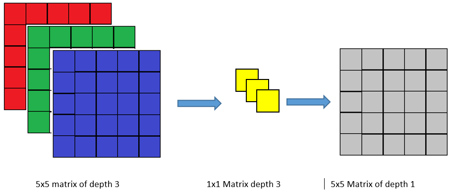

	Yadunandan Huded 
	Batch:  5
	GITHUB: https://github.com/YadunandanH/EIP3.git


## Convolution 

Convolution is a process which can be used to extract fetures from a given image using a small convolution matrix(Populerly known as kernel ). Convolution is nothing but taking the weighted sum of the pixels surrounding a central pixel of Convolution matrix by super imposing and draging across the image.  The resultant image obtained after convolution is always lesser/equilant in size to the original image. 

Example: Consider the following example with a 6x6 matrix and when we convolve this image using a 5x5 convolution matrix we will get an output image of size 2x2.

​	


## Epochs

 In 1 Epoch the complete data/training vector is moved to and fro in the network for one time in order to update the weights. 1 epoch consists one or more iterations based on batch size. i.e, Iteration = Size of Training vector/batchsize. Art of choosing the number of epochs deside the efficiency of the neural network. i.e if number of epochs are less the model undercuts and larger number of epochs cause higher compute cost, so one should lern the art of decide number of epochs wisely.   


## 3x3 Convolution

Size of the convolution matrix is decided based on the size of feature to be extracted. In Convolution Neural Network most of the time we use 3x3 convolution matrix because it’s convenient as well as efficient enough to capture most of the features in the image.

Effect of 3x3 Convolution: When we apply 3x3 convolution matrix on an image of size NxN. The resultant image will be of size (N-2) x (N-2) i.e., 2 rows and 2 columns will be reduced. Consider the below image we calculate resultant matrix by dragging the kernel across pixels and taking the weighted sum.  


## 1x1 Convolution

Convolution operation conducted using 1x1 convolution matrix. Despite being tiny in size 1x1 convolution matrix is very powerful and popular neural net architecture like ResNet and inception makes use of 1x1 Convolution matrix.

Using this convolution matrix we can reduce the size of feature set. Filters like 3x3, 5x5 and (7x7 in that matter all other filters) does not reduce depth of the feature map, where as 1x1 convolution reduced the depth of the feature map and helps to reduce the size of the feture map in a greater extent. 




## Kernels/filters: 

Is a small matrix which can be used to perform many operations on an Image. The kernel can be of any size i.e., 3x3, 5x5, 7x7 etc. Using kernel we can perform operations like bluring,  edge detection etc. Below code snippet applys edge detection filter on an image. 

```python
import cv2
import numpy as np
#your image
img = cv2.imread(r'Path\\*.png')
'''
Edge detection Kernal
-1 -1 -1 
-1  8 -1
-1 -1 -1
'''
x = [[-1,-1,-1],[-1,8,-1],[-1,-1,-1]]
kernel = np.asarray(x)
output_image = cv2.filter2D(img,-1,kernel)
cv2.imwrite(r'Path\\blurred.png',output_image) 

```


The above images shows the image before and after applying edge detection filter.​                               

## Feature Map

When we apply a convolution using a kernel the output image is a feature map. These feature maps may be corners, edges etc. Different kinds of kernels produces different feature maps. These feature maps are useful in feature extraction. 

Example: Consider an image and the two different 3x3 kernel. When the kernel/convolution matrix convolved over the image. The resultant images are called as feature map. Following image has the original  image and Feature maps generated using two different kernels. 


## Feature Engineering

There were mainly two types of approaches used in old computer vision practices mainly.

1) Global Feature Descriptor

2) Local Feature Descriptor

1) Global Feature Descriptor

##### Gloabal Feature Descriptor

Complete image is treated as feature vector. Following are the various approches by which we can obtain global feature descriptor.

i) Local binary Pattern:

Popularly known as LBP. Is used as texture descriptors by comparing neighbouring pixels. This creates a local representation of a texture

ii) HoG (Histogram oriented Gradients):

 We know that corners and edges are main building blocks of shape of an object. In HoG distribution of magnitude and directions of gradients are treated as features

iii) Color Histograms: 

The distribution of different color pixels present in an image can be represented using color histograms. In order to create color histogram we define bins. Each bin consists of a range of color pixels.

##### Local Feature descriptors 

Small portion of image is treated as feature vector rather than complete image.

i) SIFT (Scale Invarient Feature Transform):

 Used for feature detection. It works using an operator called difference of Gaussian. A 16x16 patch surrounding an identified object is selected further this block is segmented and feature points which are present in the block are detected by searching for local maxima using DoG . SIFT is computationally expensive.

ii) SURF: 

Works based on Hessian Matrix. Here Hessian matrix consists functions obtained after 2nd order partial derivatives as its elements. Computationally faster compared to SIFT.

iii) ORB (Oriented FAST and Rotated BRIEF): 

ORB is an alternative for SIFT and SURF and it is Combination of FAST and BRIEF (Uses simple binary test between different paches of the image)